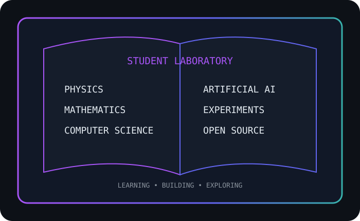
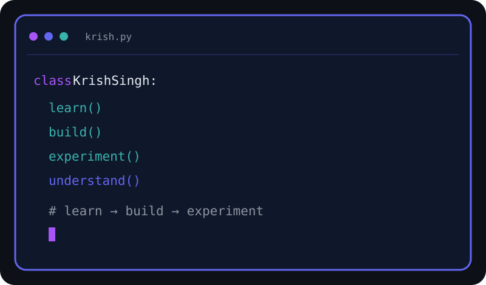

<div align="center">

# `KRISH SINGH`

### Student Developer • AI Explorer • Physics Enthusiast • Builder

<p align="center">
  
</p>

<p>
  <b>PHYSICS</b> &nbsp;×&nbsp;
  <b>ARTIFICIAL INTELLIGENCE</b> &nbsp;×&nbsp;
  <b>SOFTWARE ENGINEERING</b> &nbsp;×&nbsp;
  <b>EXPERIMENTS</b>
</p>

<p>
  <code>LEARN</code> → <code>BUILD</code> → <code>BREAK</code> → <code>UNDERSTAND</code>
</p>

</div>

---

## 📖 Student Laboratory

<p align="center">
  
</p>

> I am a student developer who enjoys turning ideas into working systems, interactive experiments, and software that people can actually explore.

### What I explore

| Area | Focus |
|---|---|
| ⚛ **Physics** | Mechanics, optics, waves, simulations, interactive experiments |
| 🤖 **Artificial Intelligence** | Practical AI systems and intelligent applications |
| 💻 **Software Engineering** | Frontend, backend, APIs, architecture, and real-world systems |
| 🧮 **Mathematics** | The concepts behind computation, physics, and engineering |
| 🧪 **Experiments** | Learning by building, testing, breaking, and improving |
| 🌐 **Open Source** | Sharing projects and learning in public |

---

## 💻 Source Window

<p align="center">
  
</p>

```python
class KrishSingh:

    role = "Student Developer"

    focus = [
        "Physics",
        "Artificial Intelligence",
        "Software Engineering",
        "Interactive Experiments",
    ]

    def learn(self):
        return "Understand the fundamentals"

    def build(self):
        return "Turn ideas into working systems"

    def experiment(self):
        return "Try → test → break → improve"
```

---

## 🧪 Experiment Log

> This is where ideas become projects.

### `[001]` ⚛ PhysicsLab

**Interactive Physics Laboratory**

A large experimental environment for learning physics through interactive simulations and visual experiments.

**Exploring:** Mechanics • Optics • Waves • Motion • Simulation

**Status:** `● BUILDING`

---

### `[002]` 🛡 AI Public Safety

**AI-powered Public Safety & Emergency Response Platform**

A project exploring how AI, mobile technology, maps, realtime communication, and backend systems can support emergency response and public safety.

**Exploring:** AI • Flutter • FastAPI • PostgreSQL • Maps • Realtime Systems

**Status:** `● ENGINEERING`

---

### `[003]` 🧪 Canvas Experiments

Interactive browser-based experiments built around JavaScript and Canvas.

**Exploring:** Visual simulation • Physics engines • Interactive systems

**Status:** `● EXPERIMENTING`

---

### `[004]` 🌐 Open Source

Learning by building projects publicly, documenting experiments, and improving through iteration.

**Status:** `● CONTINUOUS`

---

# ⚛ PhysicsLab

<div align="center">

### `INTERACTIVE PHYSICS LABORATORY`

**Learn physics by seeing it move.**

</div>

PhysicsLab is an interactive environment focused on turning physics concepts into visual experiments instead of keeping them only as equations on a page.

### Laboratory areas

```text
MECHANICS
├── Kinematics
├── Laws of Motion
├── Work, Energy & Power
├── System of Particles
├── Rotational Motion
├── Gravitation
├── Mechanical Properties
├── Oscillations
└── Waves

OPTICS
├── Convex Lens
├── Concave Lens
├── Concave Mirror
├── Convex Mirror
├── Refraction
├── Prism
├── Total Internal Reflection
├── Optical Instruments
└── Light Ray Laboratory
```

**Core idea:**

> `EQUATION → MODEL → SIMULATION → UNDERSTANDING`

---

# 🛡 AI Public Safety

<div align="center">

### `BUILDING TECHNOLOGY FOR EMERGENCY RESPONSE`

</div>

An AI-powered public safety and emergency response platform designed around communication between citizens, emergency services, police, and intelligent software systems.

### Core direction

```text
CITIZEN
   │
   ├── Emergency SOS
   ├── Incident Reporting
   ├── Location Sharing
   └── AI Assistance
          │
          ▼
     AI / BACKEND
          │
   ┌──────┼────────┐
   ▼      ▼        ▼
POLICE  DISPATCH  SERVICES
   │      │        │
   └──────┴────────┘
          │
          ▼
   EMERGENCY RESPONSE
```

### Technologies explored

`Flutter` `FastAPI` `Python` `PostgreSQL` `PostGIS` `Redis` `Firebase` `Google Maps` `AI/ML`

**Status:** `● BUILDING`

---

# 🧰 Engineering Stack

<div align="center">

### LANGUAGES

`Python` `JavaScript` `Dart` `HTML` `CSS`

### AI / ML

`Artificial Intelligence` `Computer Vision` `Machine Learning`

### BACKEND

`FastAPI` `PostgreSQL` `PostGIS` `Redis`

### FRONTEND

`Flutter` `JavaScript` `Canvas`

### DEVELOPMENT

`Git` `GitHub` `VS Code` `REST APIs`

</div>

---

# 🧠 How I Learn

```text
        ┌───────────────┐
        │    QUESTION   │
        └───────┬───────┘
                ↓
        ┌───────────────┐
        │    EXPLORE    │
        └───────┬───────┘
                ↓
        ┌───────────────┐
        │     BUILD     │
        └───────┬───────┘
                ↓
        ┌───────────────┐
        │     BREAK     │
        └───────┬───────┘
                ↓
        ┌───────────────┐
        │   UNDERSTAND  │
        └───────┬───────┘
                ↓
        ┌───────────────┐
        │    IMPROVE    │
        └───────────────┘
```

I don't want to only collect technologies.

I want to understand **why systems work, how they fail, and how to build them better.**

---

# 📊 GitHub Activity

<div align="center">


</div>

<br>

<div align="center">


</div>

---

# 🎯 2026 Mission

```text
┌────────────────────────────────────────────────────────────┐
│                         2026                               │
│                                                            │
│                    BUILD REAL SYSTEMS                      │
│                                                            │
│   ✓ Learn deeply                                           │
│   ✓ Build consistently                                     │
│   ✓ Experiment fearlessly                                  │
│   ✓ Understand fundamentals                                │
│   ✓ Contribute openly                                      │
│   ✓ Turn ideas into working projects                       │
│                                                            │
│              MAKE SOMETHING WORTH EXPLORING.               │
└────────────────────────────────────────────────────────────┘
```

---

# 🌱 Currently Exploring

```text
AI SYSTEMS
████████████████████░░░░  Exploring

PHYSICS SIMULATIONS
██████████████████████░░  Building

SOFTWARE ENGINEERING
███████████████████░░░░░  Learning

OPEN SOURCE
████████████████░░░░░░░░  Growing
```

> Progress is not a finished state. It is a system that keeps improving.

---

# 🌐 Connect

<div align="center">

<a href="https://github.com/GYSK-KRISH">
  
</a>

</div>

---

<div align="center">

```text
> krish --status

student        ✓
developer      ✓
physics        ✓
artificial-ai  ✓
builder        ✓
experimenter   ✓

SYSTEM STATUS: ● BUILDING

$ keep_building
```

### `LEARN • BUILD • EXPERIMENT • SHARE`

<sub>Designed with a student mindset and an engineering obsession.</sub>

</div>
